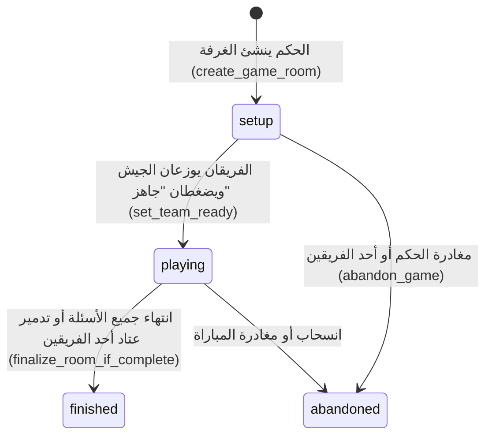

# دليل المنطق البرمجي وبنية مشروع "حيلهم بينهم - معركة السيادة" ⚔️

> **ملاحظة تذكيرية:** هذا الملف مخصص حصرياً لشرح **المنطق (Logic)**، البنية الديناميكية (Dynamic Behavior)، طريقة عمل **Supabase** بالكامل، الأخطاء والمشاكل المحتملة، وكيفية تفكيك وإعادة هيكلة ملف المعركة الرئيسي (`app/battle/page.jsx`). تم تجنب أي شرح للتصاميم أو الواجهات الثابتة.

---

## 📋 فهرس المحتويات

1. [الفكرة العامة ودورة حياة اللعبة الديناميكية](#1-الفكرة-العامة-ودورة-حياة-اللعبة-الديناميكية)
2. [بنية ونظام Supabase في المشروع (Database & Mechanics)](#2-بنية-ونظام-supabase-في-المشروع-database--mechanics)
   - [الجداول الأساسية (Tables)](#أ-الجداول-الأساسية-tables)
   - [الدوال المخزنة (RPC Functions)](#ب-الدوال-المخزنة-rpc-functions)
   - [الاشتراكات اللحظية (Realtime Subscriptions)](#ج-الاشتراكات-اللحظية-realtime-subscriptions)
   - [نظام الصلاحيات والحماية (Auth & RLS)](#د-نظام-الصلاحيات-والحماية-auth--rls)
3. [المنطق الديناميكي بالتفصيل (Detailed Dynamic Logic)](#3-المنطق-الديناميكي-بالتفصيل-detailed-dynamic-logic)
   - [تجهيز الغرفة والأسئلة (Room Setup & Question Selection)](#أ-تجهيز-الغرفة-والأسئلة-room-setup--question-selection)
   - [مرحلة توزيع الجيش ورقعة 6×6 (Deployment & Grid Logic)](#ب-مرحلة-توزيع-الجيش-ورقعة-66-deployment--grid-logic)
   - [المؤقت الموحد بدقة الخادم (Server-Synced Countdown Timer)](#ج-المؤقت-الموحد-بدقة-الخادم-server-synced-countdown-timer)
   - [مرحلة القتال والضربات (Combat & Strike Resolution)](#د-مرحلة-القتال-والضربات-combat--strike-resolution)
   - [منطق أدوات المساعدة والفزعات (Tactical Tools Engine)](#هـ-منطق-أدوات-المساعدة-والفزعات-tactical-tools-engine)
   - [منطق نهاية المباراة وحسم الفوز (Victory & Completion Logic)](#و-منطق-نهاية-المباراة-وحسم-الفوز-victory--completion-logic)
4. [تحليل المشاكل والأخطاء والتحسينات الموصى بها (Bugs & Optimizations)](#4-تحليل-المشاكل-والأخطاء-والتحسينات-الموصى-بها-bugs--optimizations)
5. [خطة تفكيك وتوزيع ملف المعركة الضخم (`app/battle/page.jsx`)](#5-خطة-تفكيك-وتوزيع-ملف-المعركة-الضخم-appbattlepagejsx)
   - [مشكلة الملف الحالي](#أ-مشكلة-الملف-الحالي)
   - [الهيكلية الموصى بها للهوك المخصصة والمكونات (Architecture Blueprint)](#ب-الهيكلية-الموصى-بها-للهوك-المخصصة-والمكونات-architecture-blueprint)
   - [شرح الكود الموزع خطوة بخطوة](#ج-شرح-الكود-الموزع-خطوة-بخطوة)

---

## 1. الفكرة العامة ودورة حياة اللعبة الديناميكية

اللعبة هي نظام محاكاة استراتيجي لحظي (Realtime Turn-Based Strategy) يدار بواسطة خادم Supabase وتفاعل مباشر بين 3 أطراف متصلين في وقت واحد:

1. **الحكم (Judge / Referee):** ينشئ الغرفة، يختار 6 تصنيفات، يراقب شاشات الفرق، يقرأ الأسئلة، ويحدد الإجابات الصحيحة.
2. **الفريق الأول (Team 1):** يدخل بحسابه الخاص، يوزع قواته على خريطة سرية (6×6)، ويخوض المعركة.
3. **الفريق الثاني (Team 2):** يدخل بحسابه الخاص، يوزع قواته على خريطة سرية (6×6)، ويخوض المعركة.

### الحالات الديناميكية للغرفة (`room.status`):



---

## 2. بنية ونظام Supabase في المشروع (Database & Mechanics)

يعد Supabase هو العقل المدبر والـ Backend الخادمي للعبة بالكامل. نعتمد عليه في حفظ البيانات، تطبيق القواعد الاستراتيجية عبر **RPC Functions** لمنع التلاعب (Cheating)، وإرسال التحديثات للحظية للجميع.

### أ. الجداول الأساسية (Tables)

1. **`game_rooms` (جدول الغرف):**
   - `id`: المعرف الفريد للغرفة (UUID).
   - `status`: حالة المباراة (`setup`, `playing`, `finished`, `abandoned`).
   - `current_turn`: رقم الفريق صاحب الدور الحاظر (`1` أو `2`).
   - `active_question_id`: المعرف الخاص بالسؤال المعروض حالياً.
   - `question_started_at`: طابع زمني (Timestamp) يحدده السيرفر فور اختيار السؤال لبدء المؤقت الموحد.
   - `judge_id`: `user_id` الخاص بالحكم صاحب الغرفة.
   - `selected_categories`: مصفوفة بأسماء/معرفات التصنيفات الستة المختارة.

2. **`teams` (جدول الفرق):**
   - `id`, `room_id`: معرف الفريق والغرفة.
   - `team_index`: رقم الفريق (`1` أو `2`).
   - `name`: اسم الفريق.
   - `points`: النقاط المتاحة للتسليح (تبدأ بـ 1000 نقطة).
   - `score`: إجمالي مجموع النقاط المكتسبة من الإجابات الصحيحة وتدمير الخصم.
   - `available_strikes`: عدد الضربات المتاحة للفريق حالياً للطق على خريطة الخصم.
   - `is_ready`: boolean يحدد ما إذا كان الفريق أنهى توزيع قواته.
   - `joined`: boolean يحدد دخول لاعب الفريق للغرفة.
   - `member_id`: `user_id` الخاص باللاعب المنضم للفريق.
   - `tools`: مصفوفة بالفزعات والأدوات المتاحة للفريق (`["radar_scan", "shield", "extra_strike", ...]`).
   - `used_tools`: مصفوفة بالفزعات المستهلكة.
   - `shield_active`: boolean يحدد ما إذا كان درع الحماية مفصلاً حالياً.

3. **`team_boards` (جدول الخرائط السرية - عزل الحماية):**
   - جدول محمي لا يمكن قراءته مباشرة عبر الاستعلامات العامة (SELECT).
   - يحتوي على العمود `board`: مصفوفة من 36 عنصر تُمثل الخريطة 6×6 (`infantry`, `tank`, `aircraft`, `submarine`, `mine`, أو `null`).

4. **`question_bank` & `question_categories`:**
   - بنك الأسئلة الرئيسي والتصنيفات (اسم، وصف، صورة، صعوبة، عدد الضربات).

5. **`room_questions` (أسئلة الغرفة الحالية):**
   - عند إنشاء الغرفة، يتم اختيار 36 سؤالاً (6 لكل تصنيف: 2 سهل، 2 متوسط، 2 صعب) ونسخها لهذا الجدول مع تتبع حالة السؤال (`is_used`).

6. **`combat_events` (سجل الأحداث والضربات):**
   - يسجل كل ضربة أو استخدام أداة (`strike`, `radar_scan`, `shield_block`, إلخ) لعرض البانرات وإطلاق الأصوات والردود اللحظية.

---

### ب. الدوال المخزنة (RPC Functions)

لتجنب السماح للعميل (Client Frontend) بالتعديل المباشر على جدول الغرف والفرق، تُنفذ جميع العمليات عبر دوال `SECURITY DEFINER` في PostgreSQL:

| اسم الدالة (RPC Name)       | الوظيفة والمنطق                                                                                                                                                  |
| :-------------------------- | :--------------------------------------------------------------------------------------------------------------------------------------------------------------- |
| `create_game_room`          | تنشئ الغرفة، تسجل الحكم، تختار الأسئلة 36، وتنشئ صفين في جدول `teams` للفرق.                                                                                     |
| `claim_team_slot`           | تربط حساب المستخدِم (`user.id`) بالفريق 1 أو 2 وتمنع الحكم من اللعب كفريق أو لاعب واحد من حجز الفريقين.                                                          |
| `get_team_board`            | ترجع الخريطة الخاصة بالفريق فقط أو العناصر المكشوفة للخصم لمنع الغش وفحص سورس كود المتصفح.                                                                       |
| `update_team_deployment`    | تقوم بتحديث مصفوفة الخريطة 6×6 أثناء مرحلة التوزيع وتخصم النقاط حسب نوع العتاد.                                                                                  |
| `set_team_ready`            | تتحقق أن الفريق وضع 33 عتاداً بالضبط، وتغير `is_ready = true`. إذا أصلح الفريقان جاهزين، تحول الغرفة تلقائياً إلى `status = 'playing'`.                          |
| `select_room_question`      | تقفل السؤال المختار وتضع `question_started_at = NOW()` بدءاً لعداد 60 ثانية الموحد.                                                                              |
| `get_question_answer`       | تتيح للحكم فقط جلب الإجابة الصحيحة للسؤال النشط.                                                                                                                 |
| `resolve_room_question`     | الحكم يحدد الفائز بالسؤال: تمنح الضربات للفريق الفائز أو للطرفين في التعادل، وتحدث حالة السؤال إلى مستخدم `is_used = true`.                                      |
| `grant_extra_strikes`       | تتيح للحكم منح ضربات إضافية يدوية لأي فريق عند الحاجة.                                                                                                           |
| `execute_strike`            | تٌنفذ عملية الطق على الخلية المحددة، تفحص هل توجد وحدة/لغم/درع، تنقص الضربات المتاحة، تحول الدور للفريق الآخر عند انتهاء ضرباته، وتسجل الحدث في `combat_events`. |
| `use_team_tool`             | تستهلك الفزعة المختارة (`radar_scan` تكشف 3×3، `shield` تفعل الدرع، `extra_strike` تزيد ضربة، إلخ).                                                              |
| `finalize_room_if_complete` | تفحص هل انتهت جميع الأسئلة أو تم تدمير أسطول فريق بالكامل لتنهي المباراة `status = 'finished'`.                                                                  |
| `abandon_game`              | تنهي الغرفة وتضع حالتها `abandoned` في حال المغادرة.                                                                                                             |

---

### ج. الاشتراكات اللحظية (Realtime Subscriptions)

في ملف المعركة، نستخدم `supabase.channel` للاستماع المباشر لتغييرات قاعدة البيانات عبر **Postgres Changes**:

```javascript
const roomChannel = supabase
  .channel(`realtime:room-${roomId}`)
  .on(
    "postgres_changes",
    {
      event: "*",
      schema: "public",
      table: "game_rooms",
      filter: `id=eq.${roomId}`,
    },
    (payload) => setRoom(payload.new),
  )
  .on(
    "postgres_changes",
    {
      event: "*",
      schema: "public",
      table: "teams",
      filter: `room_id=eq.${roomId}`,
    },
    (payload) => updateLocalTeams(payload.new),
  )
  .on(
    "postgres_changes",
    {
      event: "UPDATE",
      schema: "public",
      table: "room_questions",
      filter: `room_id=eq.${roomId}`,
    },
    (payload) => updateLocalQuestions(payload.new),
  )
  .on(
    "postgres_changes",
    {
      event: "INSERT",
      schema: "public",
      table: "combat_events",
      filter: `room_id=eq.${roomId}`,
    },
    (payload) => handleNewCombatEvent(payload.new),
  )
  .subscribe();
```

---

### د. نظام الصلاحيات والحماية (Auth & RLS)

- اللعبة تفرض تسجيل الدخول لحماية الغرف من التدخل.
- الحكم يحصل على رمز الصلاحيات كمالك الغرفة (`judge_id === user.id`).
- اللاعب يتم التحقق من عدم تطابق معرفه مع الحكم (`member_id !== room.judge_id`).
- جدول الخرائط `team_boards` محمي بسياسات **RLS (Row Level Security)** ولا تظهر القيم السرية للخصم إلا من خلال نتائج دالة الطق `execute_strike` أو الرادار `use_team_tool`.

---

## 3. المنطق الديناميكي بالتفصيل (Detailed Dynamic Logic)

### أ. تجهيز الغرفة والأسئلة (Room Setup & Question Selection)

- عند الضغط على "بدء اللعبة"، تنشأ الغرفة برقم معرف فريد، ويتم اختيار 6 فئات.
- يولد النظام شبكة من 36 سؤالاً (6 أسئلة لكل فئة):
  - **سهل (Easy):** 200 نقطة، 1 ضربة.
  - **متوسط (Medium):** 400 نقطة، 2 ضربة.
  - **صعب (Hard):** 600 نقطة، 3 ضربات.

### ب. مرحلة توزيع الجيش ورقعة 6×6 (Deployment & Grid Logic)

- تبدأ كل فرقة بـ **4000 نقطة**.
- أسعار الوحدات وحدودها على الشبكة (36 خلية):

| نوع العتاد  | الاسم بالعربية | التكلفة بالنقاط | الحد الأقصى المسموح بالخريطة |
| :---------- | :------------- | :-------------- | :--------------------------- |
| `infantry`  | جندي           | 20 نقطة         | 15                           |
| `armored`   | مدرعة          | 100 نقطة        | 7                            |
| `tank`      | دبابة          | 200 نقطة        | 4                            |
| `aircraft`  | طائرة          | 400 نقطة        | 3                            |
| `submarine` | غواصة          | 500 نقطة        | 2                            |
| `mine`      | لغم أرضي       | 0 نقطة          | 2 (يخصم 250 نقطة عند الإصابة) |

- **القاعدة الذهبية:** يجب على الفريق شغل **33 خلية بالضبط** وترك 3 خلايا فارغة فقط للضغط على زر "جاهز".
- **التعبئة التلقائية العشوائية (`handleAutoFill`):** تستخدم خوارزمية **Fisher-Yates Shuffle** لتوزيع الـ 33 قطعة عشوائياً وتعيين النقاط المتبقية تلقائياً وتحديث السيرفر عبر `update_team_deployment`.
- **التحسين للتجاوب الفوري (Optimistic Update & Debouncing):** عند النقر على الخلايا لتوزيع القوات، يتم تحديث واجهة المستخدم فوراً بدون انتظار الشبكة، ثم تُجمع التغييرات وتُرسل بدالة `debounce` بعد 350 ملي ثانية لتخفيف الضغط على السيرفر.

---

### ج. المؤقت الموحد بدقة الخادم (Server-Synced Countdown Timer)

لمنع اختلاف التوقيت بين الأجهزة بسبب بطء المتصفحات أو تأخر الشبكة (Clock Skew & Timer Drift):

1. عند اختيار سؤال، يضع السيرفر الطابع الزمني `room.question_started_at`.
2. يحسب كل متصفح (الحكم والفرقان) الوقت المتبقي معادلياً كل 250 ملي ثانية:

$$\text{Elapsed} = \frac{\text{Date.now()} - \text{startedAt}}{1000}$$
$$\text{Remaining} = \max(0, \lceil 60 - \text{Elapsed} \rceil)$$

3. يتطابق الوقت تماماً في جميع الشاشات تلقائياً! عند الوصول للثواني الـ 10 الأخيرة، يصدر المؤقت صوتاً تحذيرياً (`tick`) وعند الصفر يصدر صوت انتهت الإجابة (`timeout`).

---

### د. مرحلة القتال والضربات (Combat & Strike Resolution)

1. الفريق صاحب الدور يختار سؤالاً.
2. الحكم يجيب الفريق شفهياً، ثم يضغط الحكم نتيجة السؤال:
   - **فوز الفريق 1:** يحصل على الضربات المقررة.
   - **فوز الفريق 2:** يحصل على الضربات المقررة.
   - **تعادل:** كلاهما يحصل على الضربات.
3. يفتح للشاشة المشفرة لخريطة الخصم. يضغط اللاعب على الخلية المستهدفة (`execute_strike`):
   - **إذا كان فيها عتاد:** تحسب إصابة (`hit`)، يخسر الخصم الوحدة وتضاف لنتيجة الضارب.
   - **إذا كانت فارغة:** تحسب ضائعة (`miss`).
   - **إذا كانت لغم:** يصدر صوت انفجار (`mine`) وتطبق عقوبة اللغم.
   - **إذا كان الدرع مفعلاً:** تُصد الضربة ويستنفد الدرع.
4. تُنقص ضربة من رصيد الضربات المتاحة `available_strikes`. عند وصولها لـ 0، ينتقل الدور تلقائياً للفريق المنافس: `current_turn = 3 - attacker_team_index`.

---

### هـ. منطق أدوات المساعدة والفزعات (Tactical Tools Engine)

- **الرادار / الكاشف (`radar_scan` / `the_detector`):** يكشف الخلية المختارة والمربعات الـ 8 المحيطة بها ($3 \times 3$).
- **الدرع (`shield`):** يجب تفعيله قبل فتح السؤال؛ يصد أول ضربة موجهة للجيش.
- **طقة زيادة (`extra_strike`):** تمنح طقة إضافية لرصيد الفريق.
- **اتصال بصديق (`lifeline_call`):** يطلق مؤقتاً إضافياً 60 ثانية بالواجهة.
- **فرصتين (`double_chance`):** يرفع شعاراً للحكم يوضح أن للفريق محاولتين للإجابة.
- **الحفرة (`the_hole`):** مخاطرة؛ إذا أجاب صح يكسب مزايا، وإذا أخطأ تضيع الفزعة.

---

### و. منطق نهاية المباراة وحسم الفوز (Victory & Completion Logic)

تُستدعى دالة `finalize_room_if_complete` فور انتهاء أي سؤال أو ضربة. تفحص الشرطين:

1. **استهلاك جميع الأسئلة الـ 36** في `room_questions`.
2. **تدمير جميع القطع** في خريطة أحد الفريقين.

تتغير حالة الغرفة إلى `status = 'finished'` وتظهر شاشة الاحتفال بالفائز مع إحصائيات المباراة الكاملة للحكم والفرق.

---

## 4. تحليل المشاكل والأخطاء والتحسينات الموصى بها (Bugs & Optimizations)

بعد الفحص المباشر لكود المشروع، تم رصد النقاط التالية التي تحتاج إصلاحاً وتحسيناً:

### 1. مشكلة صلاحية دالة نهاية اللعبة (`finalize_room_if_complete`)

- **السبب:** الدالة قد تسبب خطأ `permission denied for function finalize_room_if_complete` إذا لم تمنح الصلاحيات للمستخدمين المعرفين وغير المعرفين.
- **الحل:** تشغيل أمر SQL التثبيتي:

```sql
GRANT EXECUTE ON FUNCTION finalize_room_if_complete TO authenticated, anon;
```

### 2. تعارض التحديث اللحظي لـ `teams` مع التعديل المحلي أثناء التوزيع (Race Condition)

- **السبب:** عند قيام لاعب بتوزيع الأثاث بسرعة، إذا وصل تحديث Realtime من السيرفر قبل اكتمال دالة الـ Debounce، قد تُستبدل الخريطة المحلية بخريطة السيرفر القديمة وتلغي ضغطات اللاعب.
- **الحل:** الاعتماد دائماً على المرجع المحلي `pendingBoardRef` ومقارنة الطابع الزمني للتحديثات قبل استبدال الـ state.

### 3. تعليق محرك الصوت على هواتف iOS و Android (AudioContext Interruption)

- **السبب:** متصفحات الموبايل تمنع تشغيل `AudioContext` تلقائياً بدون إيماءة لمس مباشرة من المستخدم (`user gesture`).
- **الحل:** إضافة مستمع لحدث `touchstart` أول مرة في الشاشة لعمل `audioContext.resume()`.

### 4. تحسين أداء الاستعلامات بفهارس قاعدة البيانات (DB Indexes)

- يُوصى بإضافة الفهارس التالية لـ Supabase لسرعة جلب أحداث القتال والأسئلة:

```sql
CREATE INDEX IF NOT EXISTS idx_combat_events_room_id ON combat_events(room_id, created_at DESC);
CREATE INDEX IF NOT EXISTS idx_room_questions_room_id ON room_questions(room_id);
```

---

## 5. خطة تفكيك وتوزيع ملف المعركة الضخم (`app/battle/page.jsx`)

### أ. مشكلة الملف الحالي

الملف الحالي يحتوي على أكثر من **2060 سطر كود**، ويجمع في مكان واحد:

- منطق الجلسة والتوثيق (Auth & Sessions).
- جلب البيانات والاستماعات اللحظية (Data fetching & Realtime).
- مؤقت الـ 60 ثانية ومؤقت الفزعات.
- محرك المؤثرات الصوتية (Web Audio API Engine).
- منطق التوزيع المالي والحسابي على شبكة 6×6.
- شاشة اختيار الدور (Gateway Screen).
- شاشة الحكم لتجهيز المباراة (Judge Setup Monitor).
- شاشة الحكم أثناء القتال (Judge Combat Dashboard).
- شاشة الفريق أثناء التوزيع (Army Deployment Screen).
- شاشة الفريق أثناء القتال (Team Combat Dashboard).

هذا يجعل التعديل عليه صعباً جداً ويؤدي لأخطاء غير متوقعة عند تغيير أي سطر!

---

### ب. الهيكلية الموصى بها للهوك المخصصة والمكونات (Architecture Blueprint)

نقوم بتقسيم الكود إلى **مطبخ منطقي (Custom Hooks)** و **شاشات العرض (Screen Components)**:

```text
├── hooks/
│   └── battle/
│       ├── useBattleAuth.js         # التوثيق والتحقق من حساب المستخدم ورتبته
│       ├── useBattleRoom.js         # جلب بيانات الغرفة والأسئلة والاشتراك اللحظي Realtime
│       ├── useSyncedTimer.js        # عداد الـ 60 ثانية الموحد والمؤثرات الصوتية
│       ├── useArmyDeployment.js     # منطق شبكة الـ 6×6، التكلفة، النقاط والتعبئة العشوائية
│       └── useBattleActions.js      # تنفيذ دوال RPC (الضربات، الفزعات، اختيار الأسئلة)
│
├── components/
│   └── battle/
│       ├── screens/
│       │   ├── GatewayScreen.jsx             # شاشة اختيار الصفة (حكم/فريق 1/فريق 2)
│       │   ├── ArmyDeploymentScreen.jsx      # شاشة توزيع عتاد الفريق قبل اللعب
│       │   └── JudgeSetupMonitorScreen.jsx   # شاشة الحكم أثناء انتظار جاهزية الفرق
│       ├── JudgeCombatDashboard.jsx          # لوحة الحكم أثناء القتال (موجودة مسبقاً)
│       ├── TeamCombatDashboard.jsx           # لوحة الفريق أثناء القتال (موجودة مسبقاً)
│       └── CombatShared.jsx                  # المكونات المشتركة والشبكات (موجودة مسبقاً)
│
└── app/
    └── battle/
        └── page.jsx                          # ملف الصفحة الرئيسي (نظيف ولا يتجاوز 120 سطر)
```

---

### ج. شرح الكود الموزع خطوة بخطوة

#### 1. هوك التوثيق والجلسات (`hooks/battle/useBattleAuth.js`)

```javascript
import { useState, useEffect } from "react";
import { supabase } from "../../lib/supabase";

export function useBattleAuth() {
  const [user, setUser] = useState(null);
  const [authLoading, setAuthLoading] = useState(true);

  useEffect(() => {
    supabase.auth.getSession().then(({ data: { session } }) => {
      setUser(session?.user ?? null);
      setAuthLoading(false);
    });

    const {
      data: { subscription },
    } = supabase.auth.onAuthStateChange((_event, session) => {
      setUser(session?.user ?? null);
      setAuthLoading(false);
    });

    return () => subscription.unsubscribe();
  }, []);

  return { user, authLoading };
}
```

---

#### 2. هوك المزامنة اللحظية والبيانات (`hooks/battle/useBattleRoom.js`)

```javascript
import { useState, useEffect, useCallback } from "react";
import { supabase } from "../../lib/supabase";

export function useBattleRoom(roomId, userId) {
  const [room, setRoom] = useState(null);
  const [teams, setTeams] = useState([]);
  const [questions, setQuestions] = useState([]);
  const [combatEvents, setCombatEvents] = useState([]);
  const [loading, setLoading] = useState(true);
  const [error, setError] = useState(null);

  const loadData = useCallback(async () => {
    if (!roomId) return;
    try {
      setLoading(true);
      const [roomRes, teamsRes, questionsRes, eventsRes] = await Promise.all([
        supabase.from("game_rooms").select("*").eq("id", roomId).single(),
        supabase.from("teams").select("*").eq("room_id", roomId),
        supabase.from("room_questions").select("*").eq("room_id", roomId),
        supabase
          .from("combat_events")
          .select("*")
          .eq("room_id", roomId)
          .order("created_at", { ascending: false })
          .limit(50),
      ]);

      if (roomRes.error) throw roomRes.error;
      setRoom(roomRes.data);
      setTeams(teamsRes.data || []);
      setQuestions(questionsRes.data || []);
      setCombatEvents(eventsRes.data || []);
    } catch (err) {
      setError(err.message);
    } finally {
      setLoading(false);
    }
  }, [roomId]);

  useEffect(() => {
    loadData();
  }, [loadData]);

  // الاشتراك اللحظي Realtime
  useEffect(() => {
    if (!roomId) return;
    const channel = supabase
      .channel(`room-${roomId}`)
      .on(
        "postgres_changes",
        {
          event: "*",
          schema: "public",
          table: "game_rooms",
          filter: `id=eq.${roomId}`,
        },
        (p) => setRoom(p.new),
      )
      .on(
        "postgres_changes",
        {
          event: "*",
          schema: "public",
          table: "teams",
          filter: `room_id=eq.${roomId}`,
        },
        (p) => {
          setTeams((prev) =>
            prev.map((t) => (t.id === p.new.id ? { ...t, ...p.new } : t)),
          );
        },
      )
      .on(
        "postgres_changes",
        {
          event: "INSERT",
          schema: "public",
          table: "combat_events",
          filter: `room_id=eq.${roomId}`,
        },
        (p) => {
          setCombatEvents((prev) => [p.new, ...prev].slice(0, 50));
        },
      )
      .subscribe();

    return () => {
      supabase.removeChannel(channel);
    };
  }, [roomId]);

  return {
    room,
    teams,
    setTeams,
    questions,
    combatEvents,
    loading,
    error,
    refreshData: loadData,
  };
}
```

---

#### 3. هوك المؤقت الصوتي السيرفري الموحد (`hooks/battle/useSyncedTimer.js`)

```javascript
import { useState, useEffect } from "react";

export function useSyncedTimer(room) {
  const [questionSeconds, setQuestionSeconds] = useState(60);

  useEffect(() => {
    if (
      !room?.active_question_id ||
      !room?.question_started_at ||
      room.status !== "playing"
    ) {
      return;
    }

    const startedAt = new Date(room.question_started_at).getTime();

    const tick = () => {
      const elapsed = (Date.now() - startedAt) / 1000;
      const remaining = Math.max(0, Math.ceil(60 - elapsed));
      setQuestionSeconds(remaining);
    };

    tick();
    const interval = setInterval(tick, 250);
    return () => clearInterval(interval);
  }, [room?.active_question_id, room?.question_started_at, room?.status]);

  return { questionSeconds };
}
```

---

#### 4. هوك توزيع قوات الجيش والتعبئة العشوائية (`hooks/battle/useArmyDeployment.js`)

```javascript
import { useState, useRef } from "react";
import { supabase } from "../../lib/supabase";

export function useArmyDeployment(roomId, teamIndex, activeTeam, setTeams) {
  const [selectedUnit, setSelectedUnit] = useState("infantry");
  const [isAutoFilling, setIsAutoFilling] = useState(false);
  const pendingBoardRef = useRef(null);
  const deploymentTimerRef = useRef(null);

  const unitSpecs = {
    infantry: { name: "جندي مشاة", cost: 10 },
    tank: { name: "دبابة", cost: 50 },
    aircraft: { name: "طيارة قتالية", cost: 100 },
    submarine: { name: "غواصة", cost: 200 },
    mine: { name: "لغم", cost: 0 },
  };

  const handleCellClick = (cellIndex) => {
    if (!activeTeam || activeTeam.is_ready) return;

    const pendingState = pendingBoardRef.current;
    const currentBoard = Array.from(
      { length: 36 },
      (_, i) =>
        (pendingState ? pendingState.board[i] : activeTeam.board?.[i]) ?? null,
    );
    let currentPoints = pendingState ? pendingState.points : activeTeam.points;

    if (currentBoard[cellIndex]) {
      currentPoints += unitSpecs[currentBoard[cellIndex]]?.cost || 0;
      currentBoard[cellIndex] = null;
    } else {
      const cost = unitSpecs[selectedUnit].cost;
      if (currentPoints < cost) return;
      currentPoints -= cost;
      currentBoard[cellIndex] = selectedUnit;
    }

    setTeams((prev) =>
      prev.map((t) =>
        t.team_index === teamIndex
          ? { ...t, board: currentBoard, points: currentPoints }
          : t,
      ),
    );

    const snapshot = { board: currentBoard, points: currentPoints };
    pendingBoardRef.current = snapshot;

    clearTimeout(deploymentTimerRef.current);
    deploymentTimerRef.current = setTimeout(async () => {
      await supabase.rpc("update_team_deployment", {
        p_room_id: roomId,
        p_team_index: teamIndex,
        p_board: snapshot.board,
        p_points: snapshot.points,
      });
      pendingBoardRef.current = null;
    }, 350);
  };

  const handleAutoFill = async () => {
    if (!teamIndex || isAutoFilling || activeTeam?.is_ready) return;

    const unitsToPlace = [
      ...Array(25).fill("infantry"),
      ...Array(3).fill("tank"),
      ...Array(2).fill("aircraft"),
      ...Array(1).fill("submarine"),
      ...Array(2).fill("mine"),
    ];

    const positions = Array.from({ length: 36 }, (_, i) => i);
    for (let i = positions.length - 1; i > 0; i--) {
      const j = Math.floor(Math.random() * (i + 1));
      [positions[i], positions[j]] = [positions[j], positions[i]];
    }

    const newBoard = Array(36).fill(null);
    positions.slice(0, 33).forEach((pos, idx) => {
      newBoard[pos] = unitsToPlace[idx];
    });

    const newPoints = 0; // 1000 - مجموع التكاليف = 0

    setTeams((prev) =>
      prev.map((t) =>
        t.team_index === teamIndex
          ? { ...t, board: newBoard, points: newPoints }
          : t,
      ),
    );

    setIsAutoFilling(true);
    await supabase.rpc("update_team_deployment", {
      p_room_id: roomId,
      p_team_index: teamIndex,
      p_board: newBoard,
      p_points: newPoints,
    });
    setIsAutoFilling(false);
  };

  return {
    selectedUnit,
    setSelectedUnit,
    handleCellClick,
    handleAutoFill,
    isAutoFilling,
  };
}
```

---

#### 5. الملف الرئيسي بعد التنسيق والنظافة (`app/battle/page.jsx`)

بعد تفكيك المنطق إلى الهوك المخصصة وشاشات العرض، يصبح الملف الرئيسي صغيراً، مفهوماً، ومقسماً حسب حالة اللعبة:

```javascript
"use client";

import { useSearchParams } from "next/navigation";
import { useBattleAuth } from "../../hooks/battle/useBattleAuth";
import { useBattleRoom } from "../../hooks/battle/useBattleRoom";
import { useSyncedTimer } from "../../hooks/battle/useSyncedTimer";
import { GatewayScreen } from "../../components/battle/screens/GatewayScreen";
import { ArmyDeploymentScreen } from "../../components/battle/screens/ArmyDeploymentScreen";
import { JudgeSetupMonitorScreen } from "../../components/battle/screens/JudgeSetupMonitorScreen";
import { JudgeCombatDashboard } from "../../components/battle/JudgeCombatDashboard";
import { TeamCombatDashboard } from "../../components/battle/TeamCombatDashboard";
import { RefreshCw } from "lucide-react";

export default function BattlePage() {
  const searchParams = useSearchParams();
  const roomId = searchParams.get("room_id");
  const teamIndex = searchParams.get("team")
    ? parseInt(searchParams.get("team"), 10)
    : null;
  const role = searchParams.get("role");

  const { user, authLoading } = useBattleAuth();
  const { room, teams, setTeams, questions, combatEvents, loading, error } =
    useBattleRoom(roomId, user?.id);
  const { questionSeconds } = useSyncedTimer(room);

  if (authLoading || loading) {
    return (
      <div className="min-h-screen bg-slate-50 flex items-center justify-center dir-rtl">
        <RefreshCw className="w-8 h-8 animate-spin text-cyan-600" />
      </div>
    );
  }

  // 1. شاشة اختيار الصفة (Gateway) إذا لم يُحدد فريق أو دور
  if (roomId && room && !teamIndex && !role) {
    return <GatewayScreen room={room} user={user} />;
  }

  // 2. شاشة الحكم أثناء مرحلة التحديث والتجهيز (Setup Mode)
  if (roomId && room?.status === "setup" && role === "judge") {
    return <JudgeSetupMonitorScreen room={room} teams={teams} />;
  }

  // 3. شاشة الفريق أثناء توزيع الجيش 6×6 (Setup Mode)
  if (roomId && room?.status === "setup" && teamIndex) {
    return (
      <ArmyDeploymentScreen
        roomId={roomId}
        teamIndex={teamIndex}
        teams={teams}
        setTeams={setTeams}
      />
    );
  }

  // 4. شاشة الحكم أثناء معركة الأسئلة والقتال (Playing / Finished Mode)
  if (
    roomId &&
    room &&
    ["playing", "finished"].includes(room.status) &&
    role === "judge"
  ) {
    return (
      <JudgeCombatDashboard
        room={room}
        teams={teams}
        questions={questions}
        events={combatEvents}
        questionSeconds={questionSeconds}
      />
    );
  }

  // 5. شاشة الفريق أثناء المعركة والطق (Playing / Finished Mode)
  if (
    roomId &&
    room &&
    ["playing", "finished"].includes(room.status) &&
    teamIndex
  ) {
    const activeTeam = teams.find((t) => t.team_index === teamIndex);
    const opponentTeam = teams.find((t) => t.team_index !== teamIndex);

    return (
      <TeamCombatDashboard
        room={room}
        activeTeam={activeTeam}
        opponentTeam={opponentTeam}
        questions={questions}
        events={combatEvents}
        questionSeconds={questionSeconds}
      />
    );
  }

  return null;
}
```

---

## 🎯 النتيجة والفوائد الرئيسية من هذا التقسيم

1. **فصل كامل للمهام (Separation of Concerns):** كل ملف له مسؤولية واحدة ومحددة جداً.
2. **سهولة الصيانة والتطوير:** إذا أردت تعديل حماية Supabase تذهب لـ `useBattleRoom` أو `useBattleActions` بدون المساس بالواجهات.
3. **سرعة القراءة والتتبع:** ملف `app/battle/page.jsx` أصبح يحتوي على أقل من 100 سطر بدلاً من 2060 سطر.
4. **منع الأخطاء الجانبية:** التعديل على توزيع الجيش لن يؤثر بالخطأ على مؤقت الحكم أو شاشة القتال.
